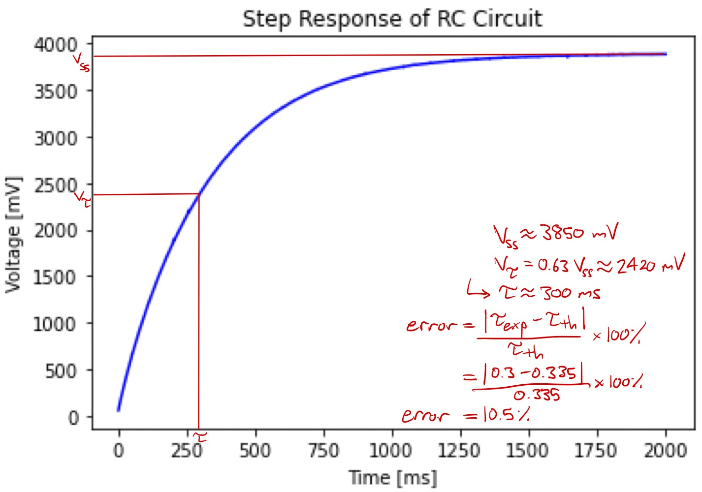

# me405_lab4

### Documentation
###### In this lab we implemented an interrupt callback function in a main program for an RC circuit. The step response for the RC circuit was performed by reading analog output voltage by converting the analog signal to a digital signal using the ADC module.
###### The time constant of the RC circuit was found through visual inspection of the plot and also by computing the time constant from value of the resistor and capacitor. The percentage difference between these experimental and theoretical values was found. 
###### The step response plot is shown below.

#### Step Response Plots

###### By visually inspecting the step response plot, our team determined the experimental time constant to be 300ms. The theoretical time constant was computed to be 335ms. 
###### The percentage difference between the theoretical and experimental time constants is 10.5%. This percent difference falls within the typical tolerance for electrical components.

#### docs
###### Contains html files for Lab 4 documentation. 

#### src
###### Contains source code files for Lab 4. 
